# Voron Trident Docks for StealthChanger

## Printing
For each dock, you will need to print:

- Dock body for your idler configuration.
- Blocker for the chosen toolhead.
- LED diffuser.

## BOM (Per Dock)

All required hardware for the docks can be obtained from the LDO tool and dock kit. 
There are provisions for countersunk 6x3 magnets for the blockers and docks if you have them available.

- M3x6 BHCS x3
- M3x40 SHCS x1
- M5x10 BHCS x2
- M5 Roll-in T Nut x2
- M3 Heat Insert x2
- StealthChanger Wiper x1
- 6x3 Magnet (N52) x4
- 5x2 Magnet (N52) x2
- SC Barf LED x1 (optional)
- M3x6 BHCS x1 (optional)

## Instructions

### Step 1

Install 2 M3 heat inserts in to the bottom of the Blocker.

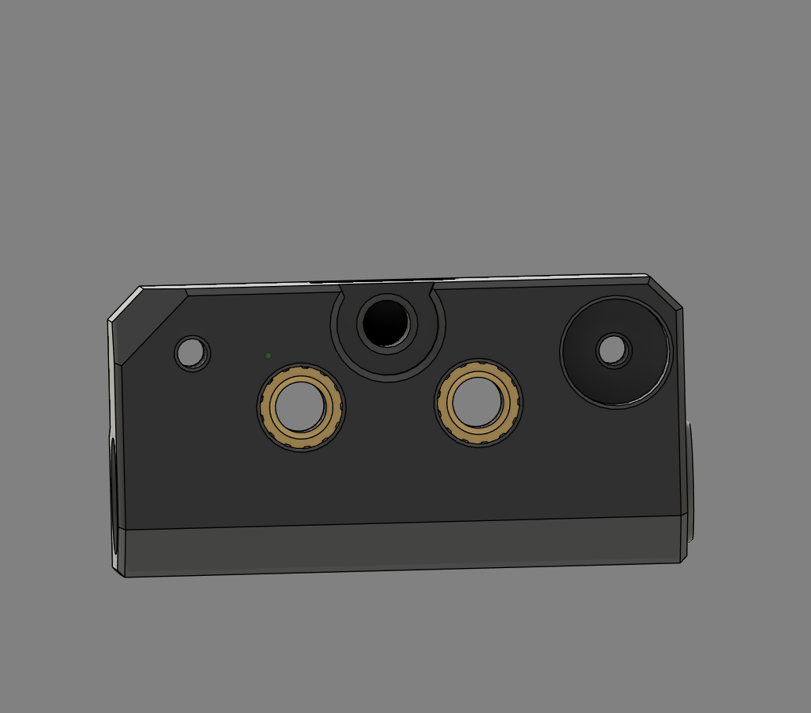

### Step 2

Install a 6x3mm magnet in to the bottom of the blocker. Use either glue or a M2x8 FHCS screw to secure it depending on the magnet type.

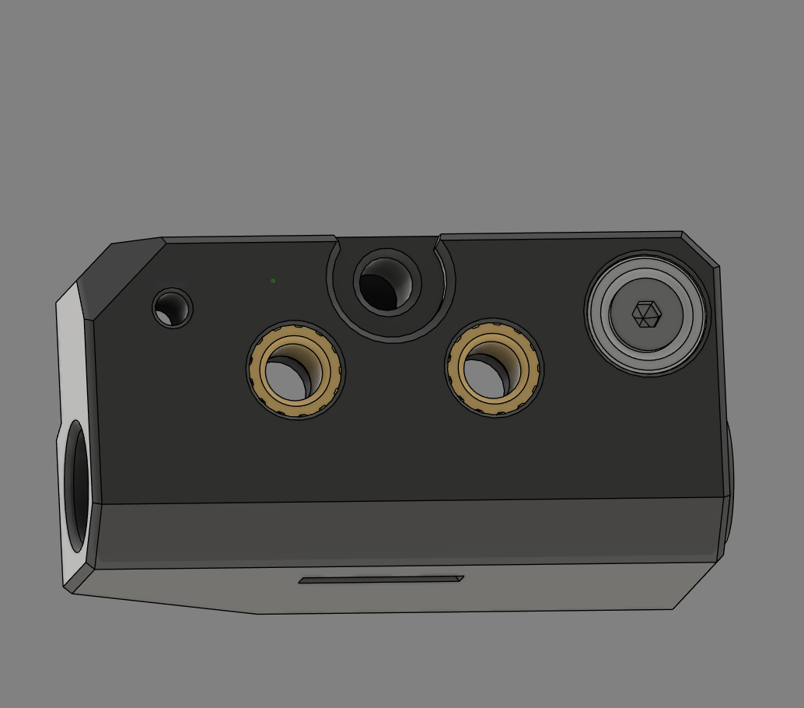

### Step 3

Install a 6x3mm magnet in to the top of the blocker. Use either glue or a M2x8 FHCS screw to secure it depending on the magnet type.

NOTE: The top magnet needs to attract to the bottom of the toolhead. Ensure you install the magnet in the correct orientation.

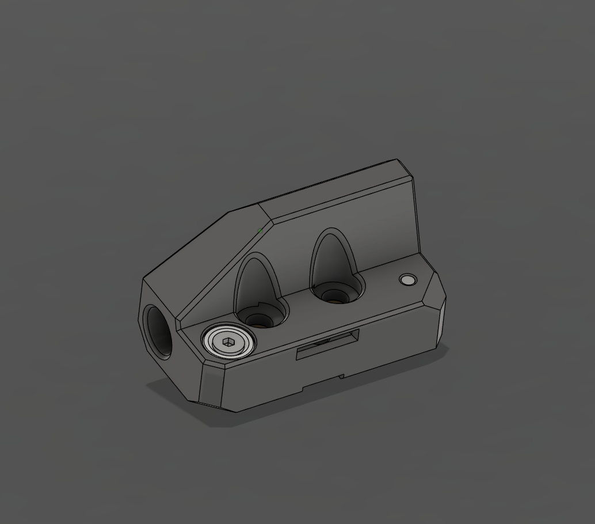

### Step 4

Insert the wiper in to the blocker and secure with 2 M3x6 BHCS screws. These screws can be loosened to adjust the wiper position later.

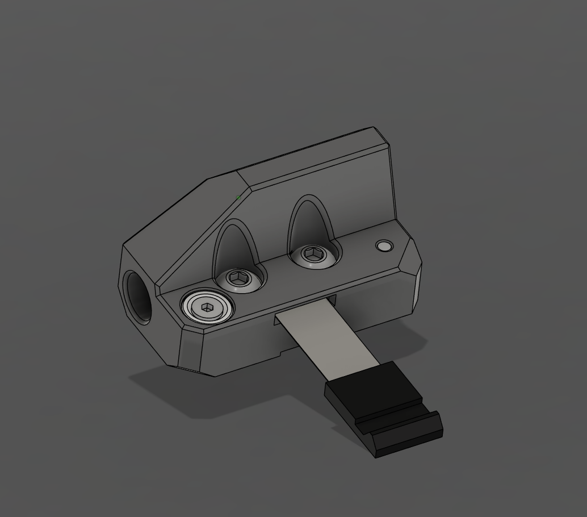

### Step 5

Install the wiper tension screw in the bottom of the blocker by screwing it in to the plastic. It doesn't need to be tightened, it is used later to adjust the pressure applied to the nozzle.

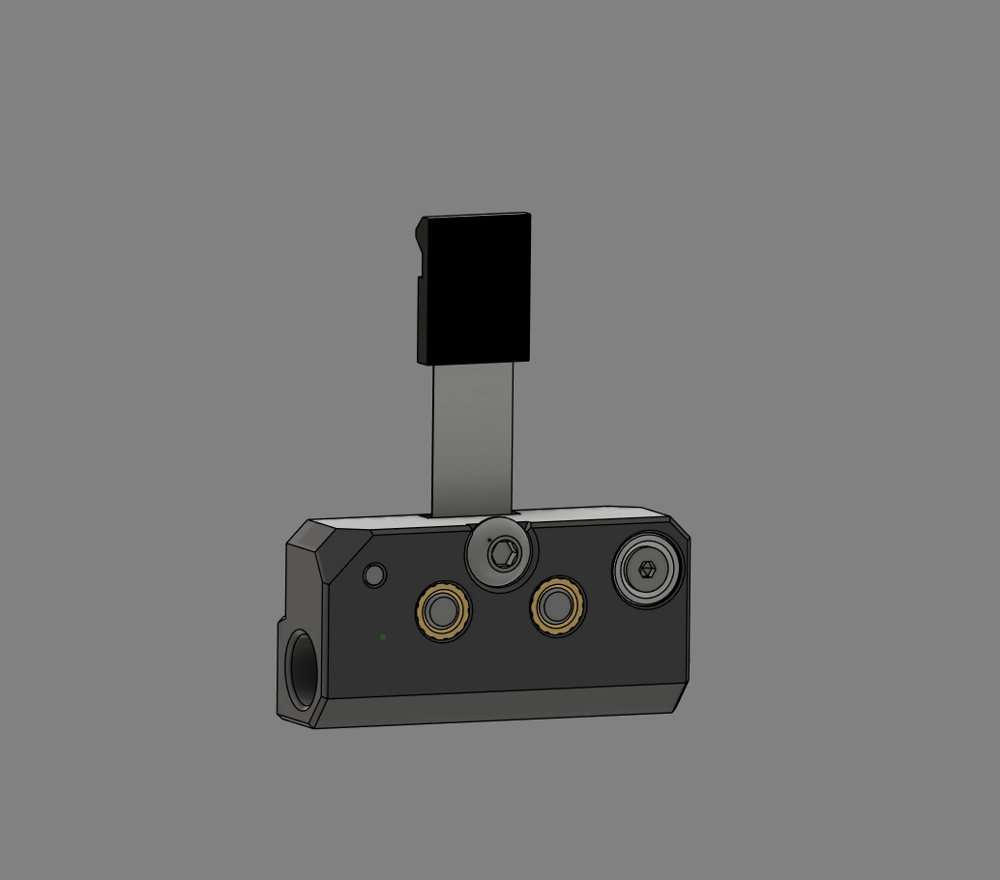

### Step 6

Install a 6x3mm magnet in to the bottom of the dock. Use either glue or a M2x8 FHCS screw to secure it depending on the magnet type.

NOTE: The magnet needs to attract to the bottom of the blocker. Ensure you install the magnet in the correct orientation.

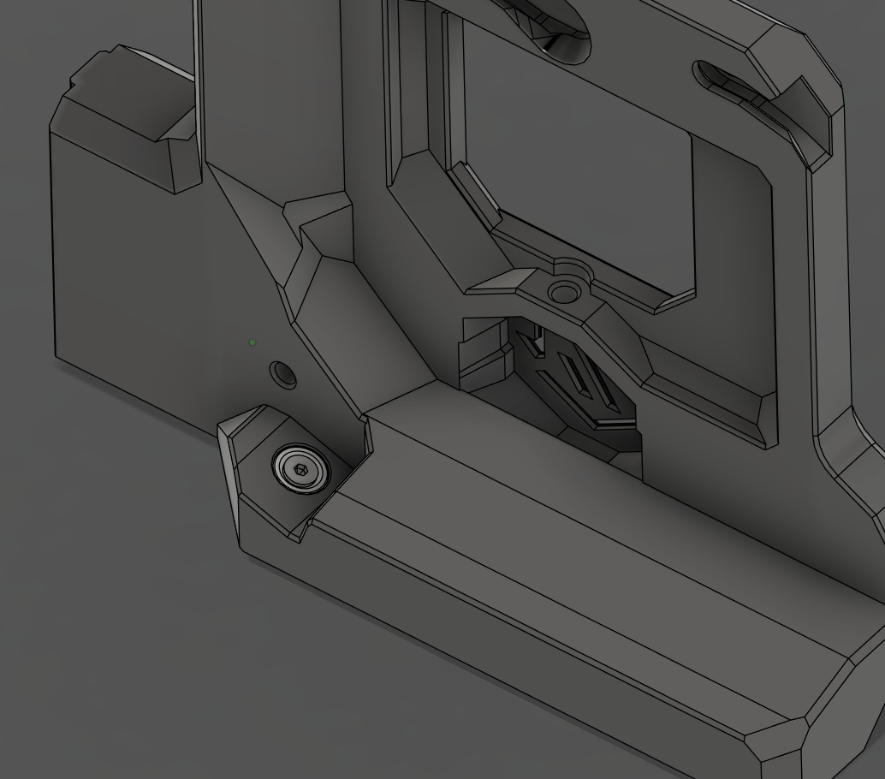

### Step 7

Install 2 5x2mm magnets in to the screw slots of the dock. Use glue to secure them.

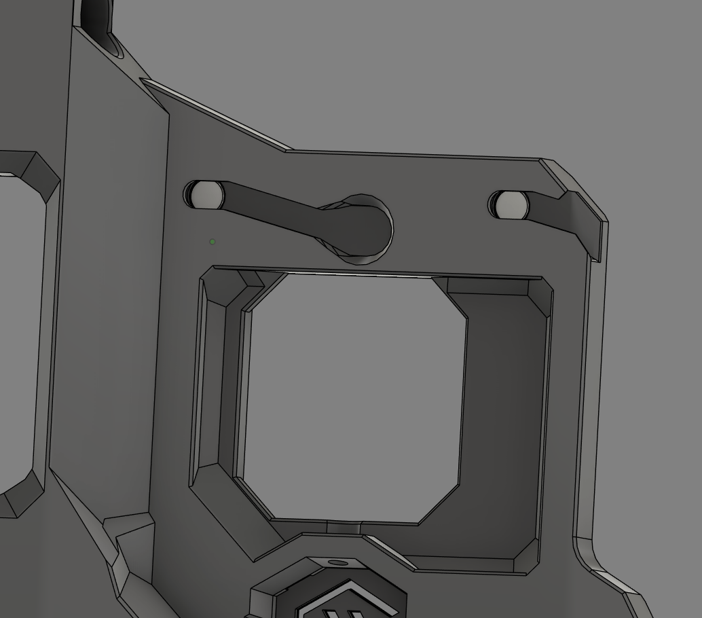

### Step 8

Install the LED diffuser by pushing the bottom in first and then pushing the top in to place. If you are not using an LED, you can add some glue to help keep it in place.

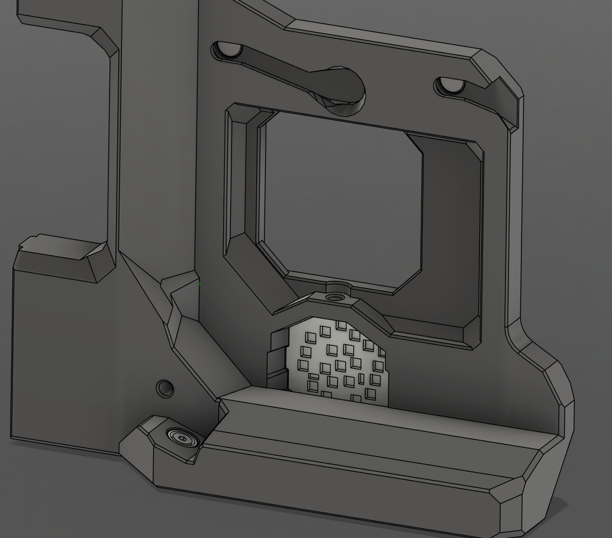

### Step 9 (Optional)

Place the SC Barf LED in place and secure with an M3x6 BHCS screw.

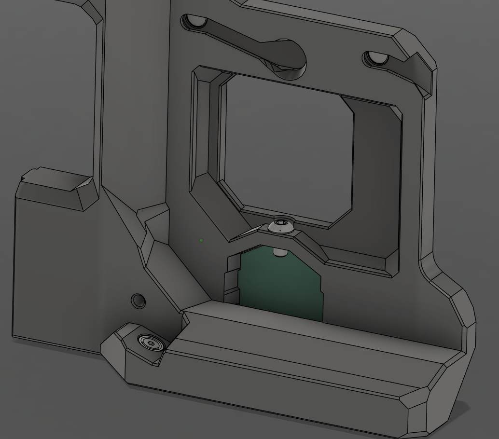

### Step 10

Install the blocker with an M3x40 SHCS screw. Do not over tighten, the blocker needs to be able to rotate freely on the screw.

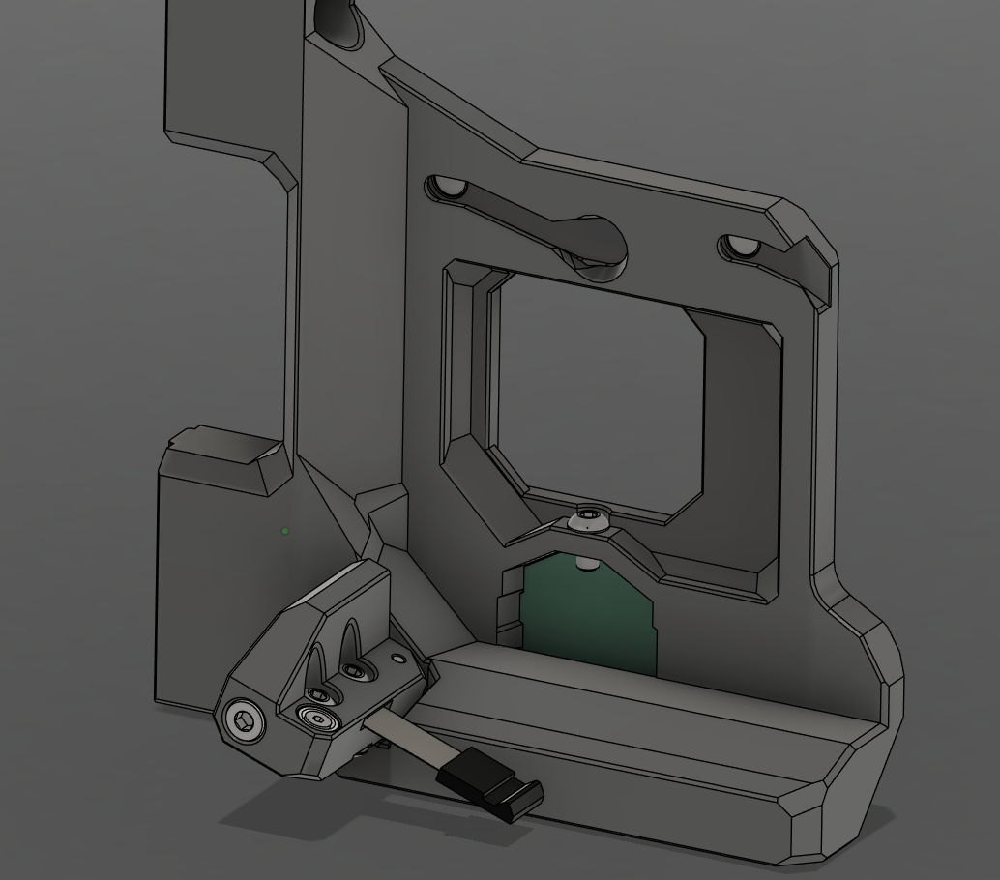

### Step 11 

Mount the dock on the printer using 2 M5x10 BHCS screws and 2 M5 roll-in T-nuts. The dock fits over the gantry's idler.

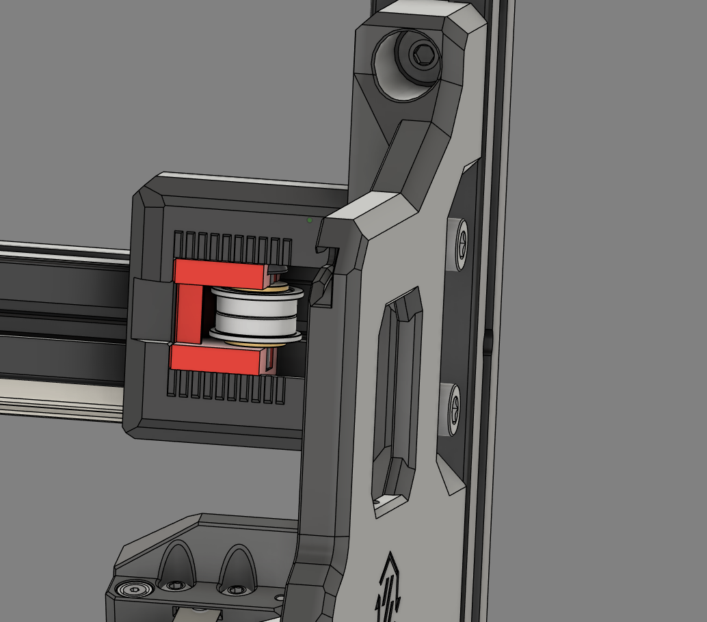