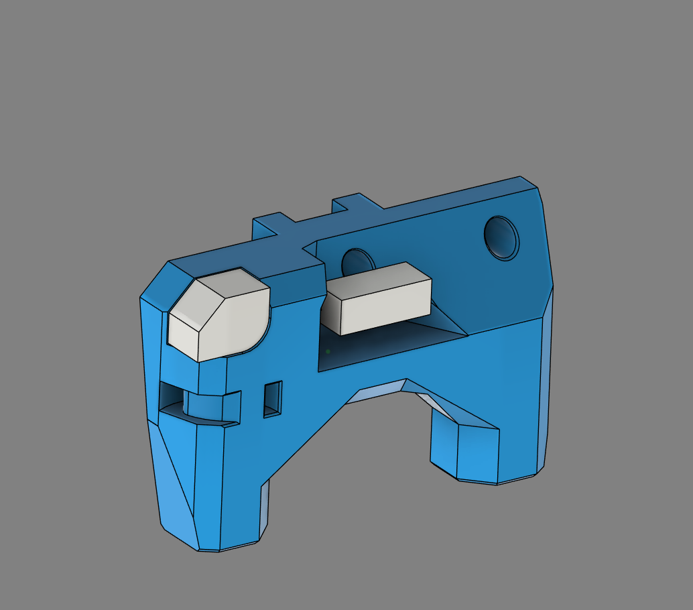
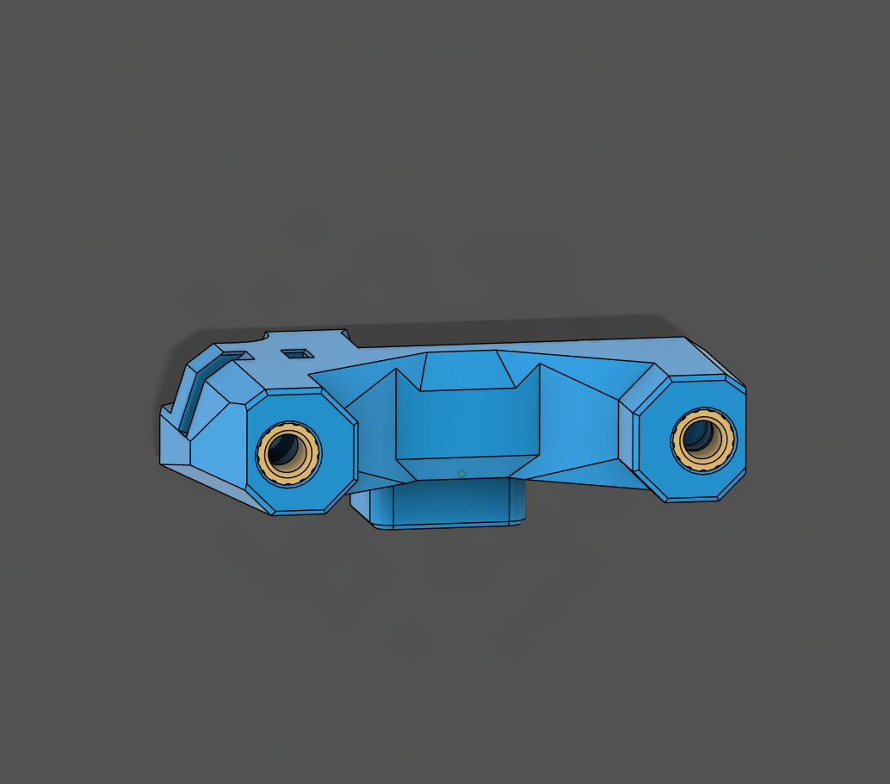
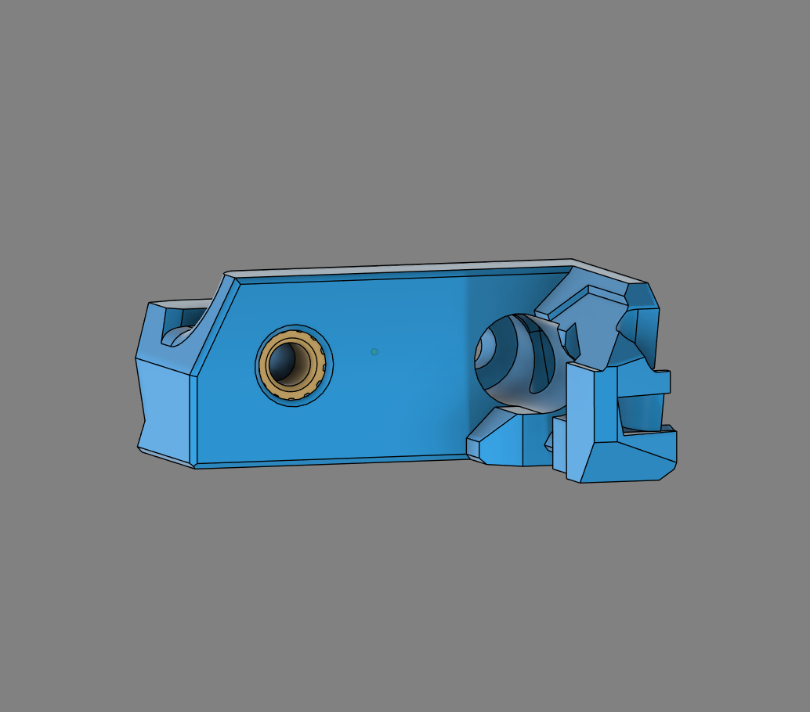
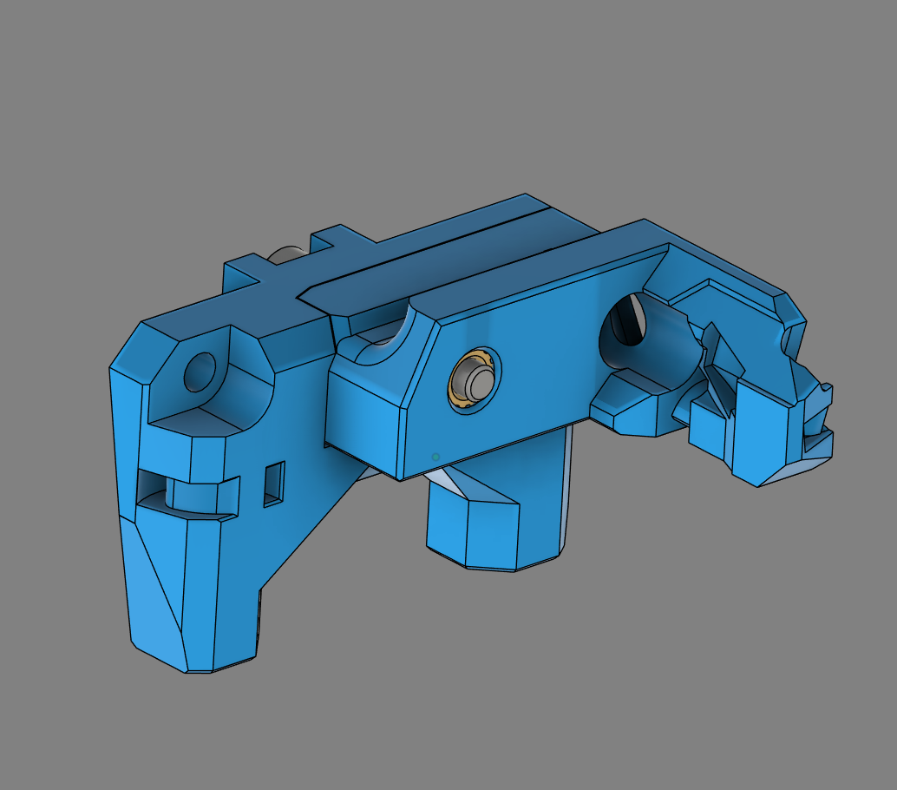
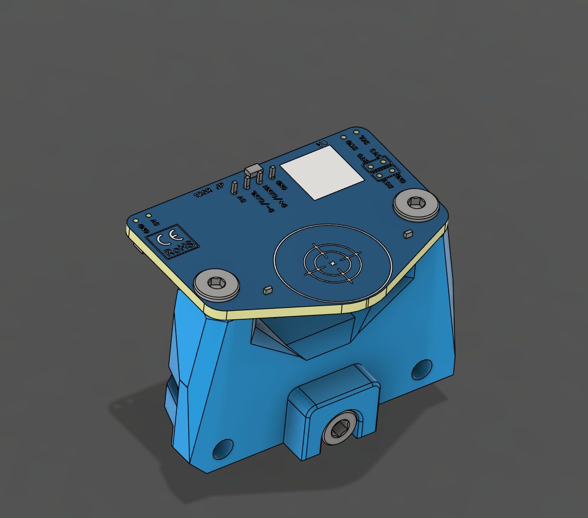
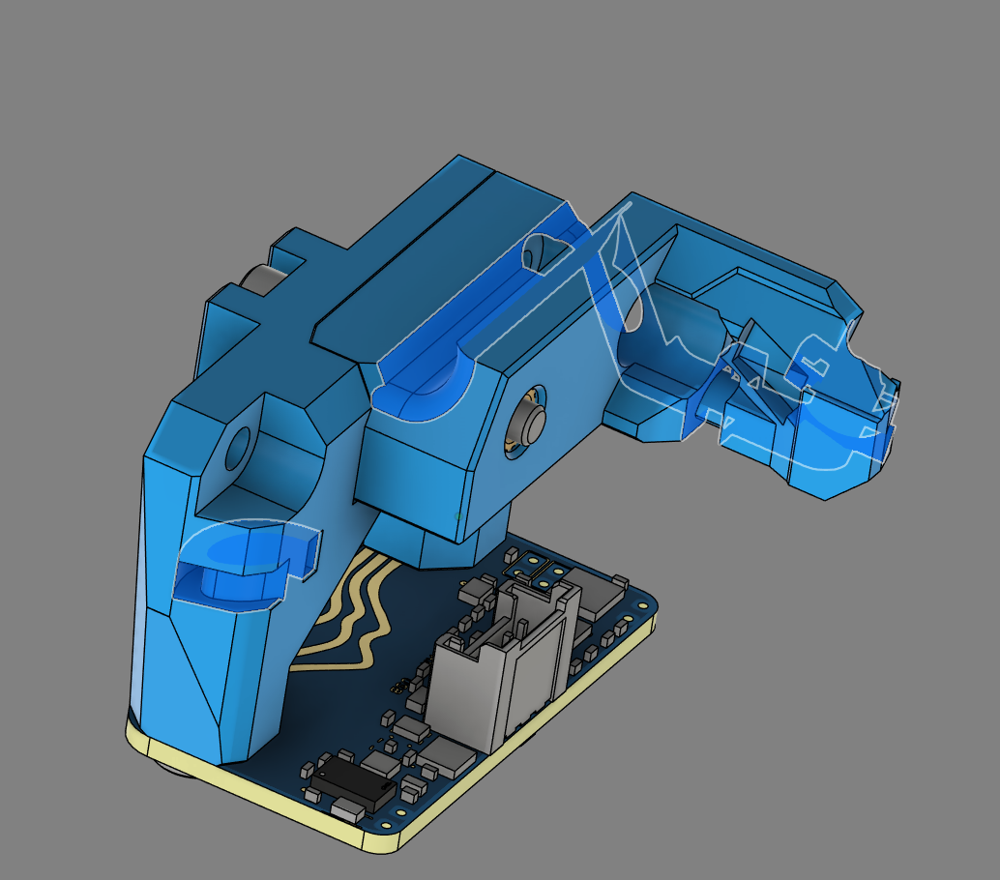
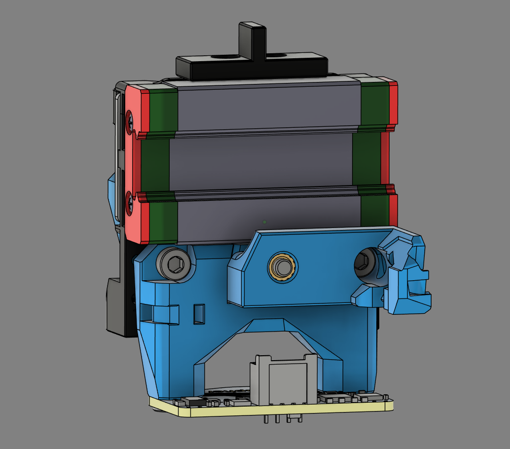

# Cartographer Mount

## Printing

- CNC Cartographer Mount x1
- CNC Cartographer Arm x1

## BOM

- M3x20 SHCS x1
- M3x16 SHCS x1
- M3x12 SHCS x1
- M3 Heat Insert x3

## Instructions

### Step 1

Remove built-in supports from the Cartographer Mount.

### Step 2

Install 2 heat inserts in to the bottom of the Cartographer Mount.

### Step 3

Install a heat insert in to the Cartographer Arm.

### Step 4

Attach the Cartographer Arm to the Mount with a M3x20 SHCS screw.

### Step 5

Attach the Cartographer to the mount using the supplied flat screws.

### Step 6

Route the cable through the provided channels and secure using 3 cable ties.

### Step 7

Attach the Cartographer Mount to the Shover On the CNC Shuttle using a M3x12 SHCS screw and a M3x16 SHCS screw.

