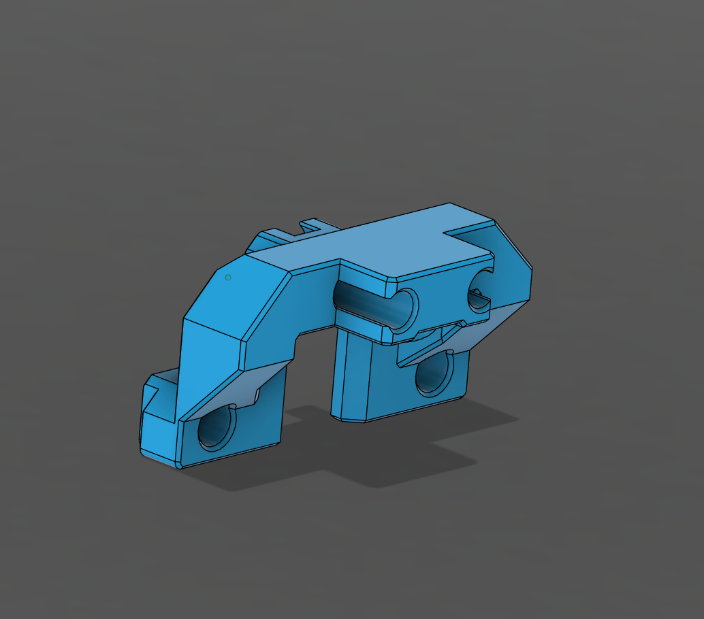
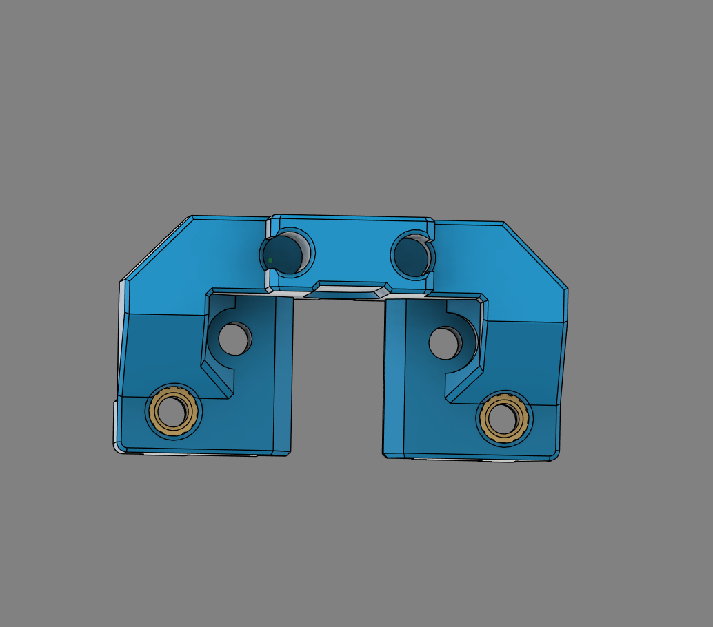
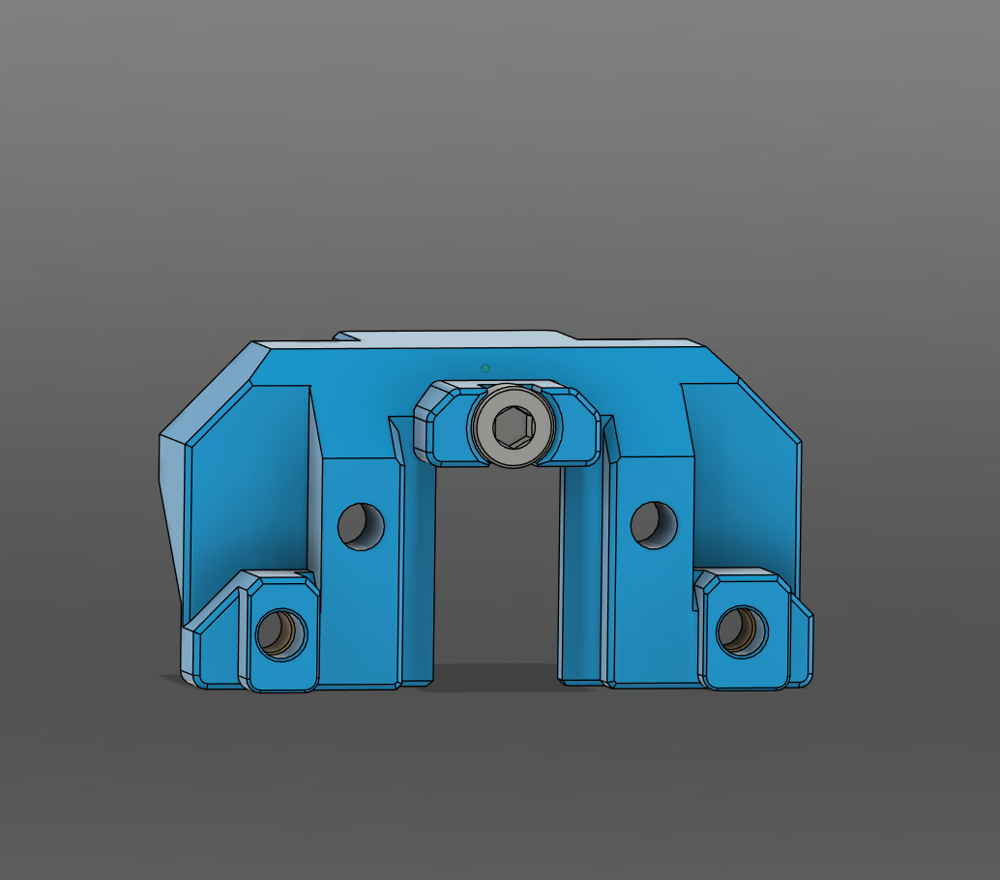
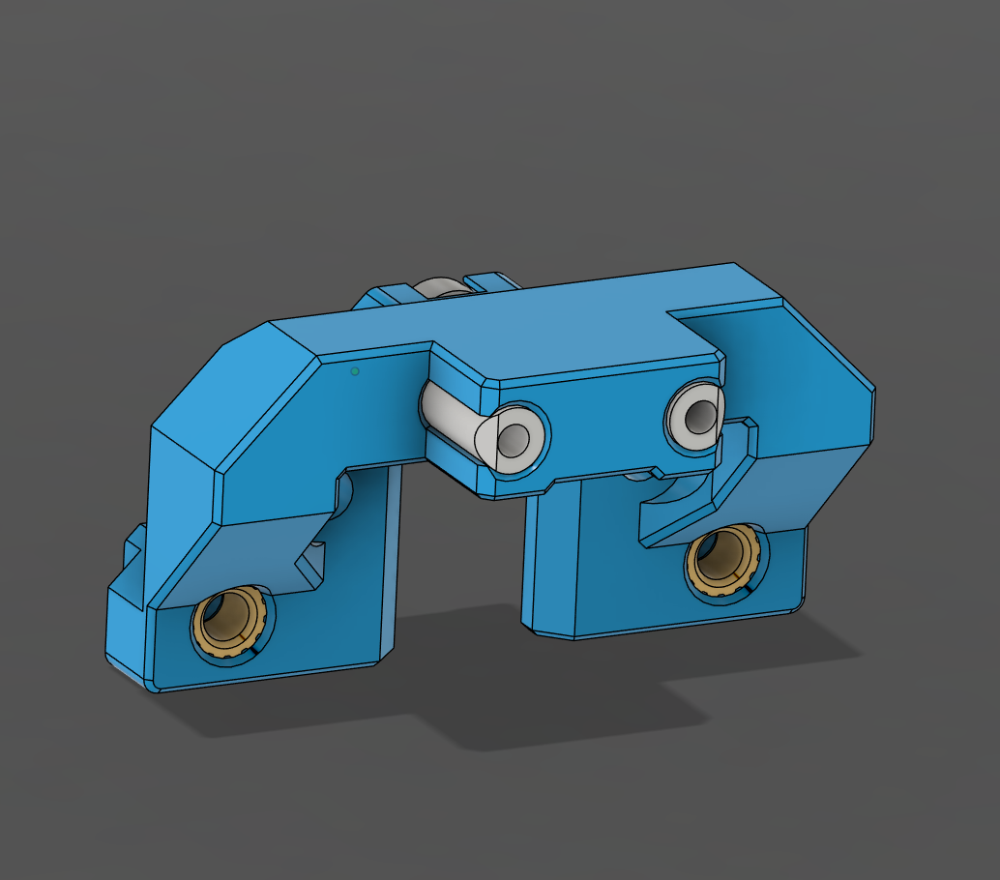
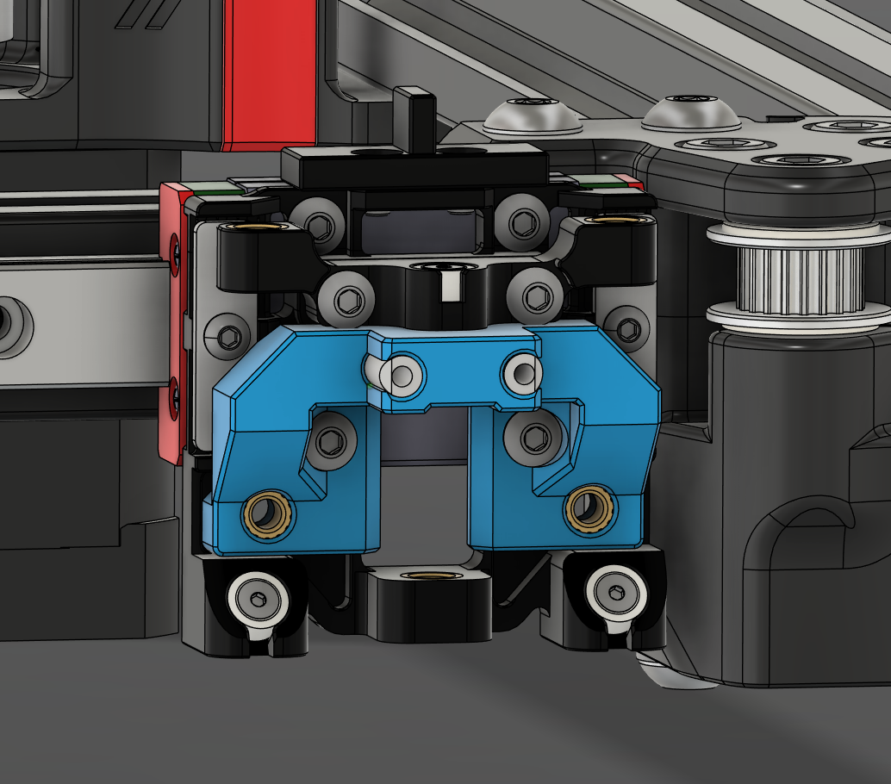
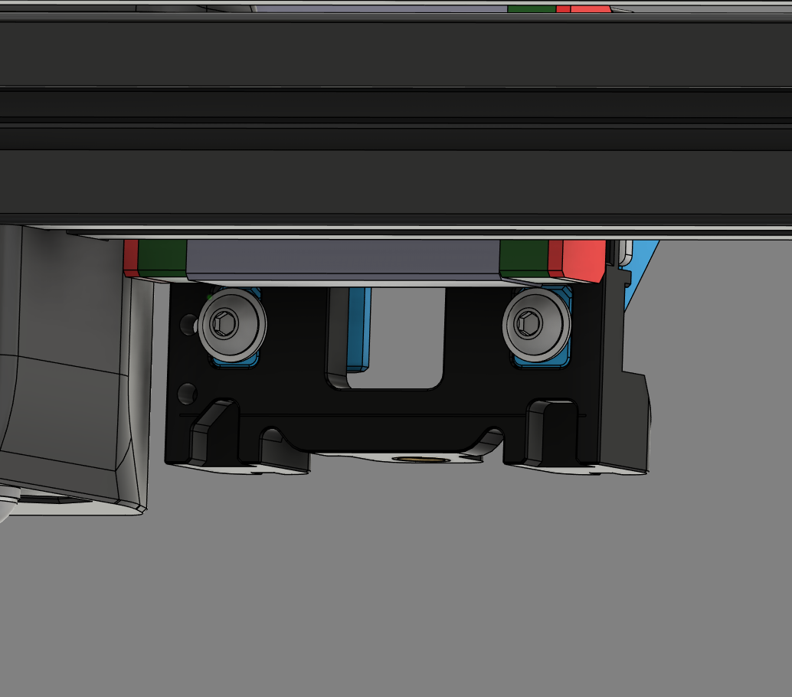

# Shover for Fixed Gantry StealthChanger

## Printing

Print the shover version for the variant of CNC shuttle you have using typical voron settings.

## BOM

- M3x6 BHCS x2
- M3x8 BHCS x2
- M3x12 BHCS x2
- M3x16 SHCS x1
- M3 Heat Insert x2
- 4mm OD PTFE 12mm Long x2 (optional)

## Instructions

### Step 1

Remove the built-in supports from the shover.

### Step 2

Install 2 M3 heat inserts into the front of the shover.

### Step 3

Install a M3x16 SHCS screw into the rear of the shover.

### Step 4

Optionally install 2 12mm pieces of PTFE tube into the front of the shover and trim the corners to match the profile.

### Step 5

Remove the lower 2 mounting screws from the CNC shuttle and place the shover onto the shuttle. Replace the 2 removed screws with 2 M3x12 BHCS screws.

### Step 6

Secure the shover to the CNC shuttle using 2 M3x8 BHCS screws with washers through the heat inserts.

## Testing

After installation, chack that the shover fits neatly in to the backplate of the tool. There should not be any friction between the tool and Shover. If it is too loose without the PTFE, try adding some. If it is too tight with the PTFE, try shaving the ptfe slightly.