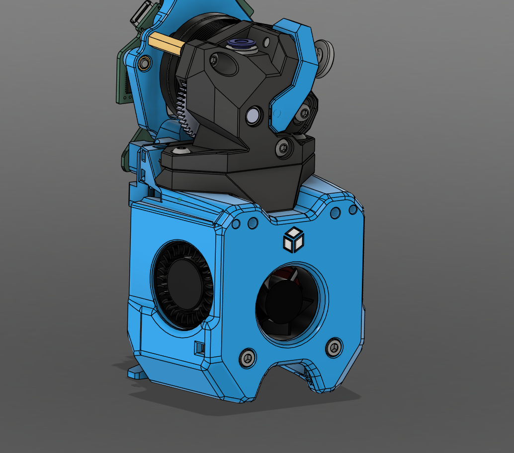
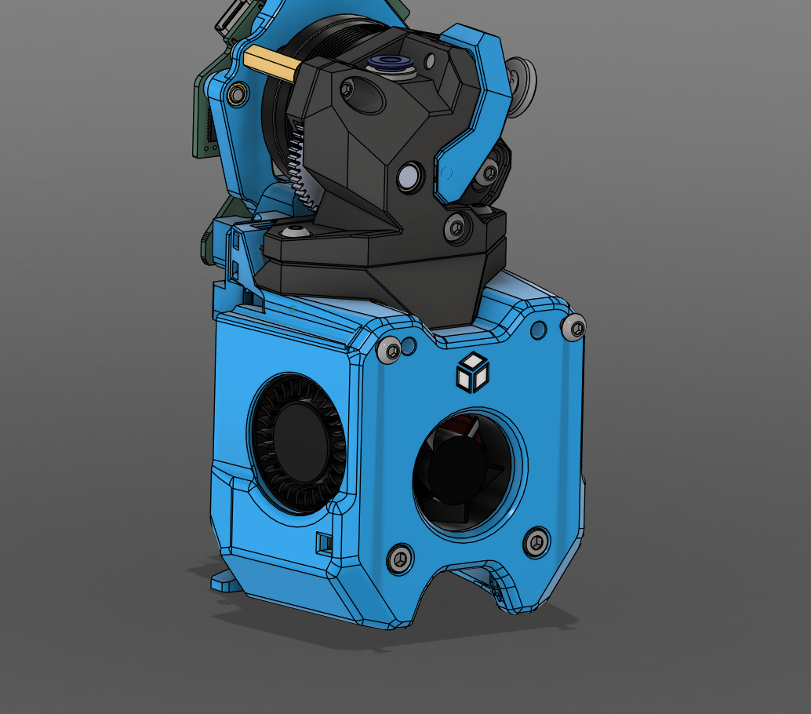
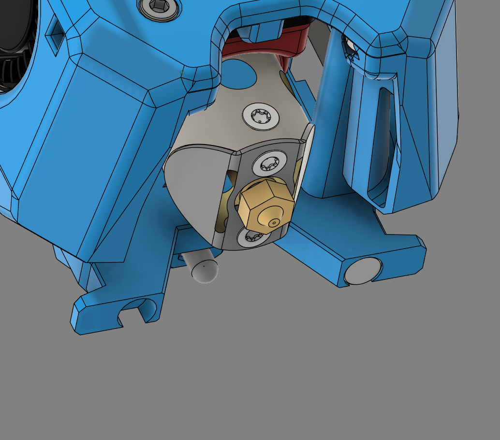

# A4T

All of the A4T cowl variants have been provided, but depending on the cowl variant, some may not be suitable.

The Rapido UHV variant in particular has the hotend fan significantly blocked by the dock.

## Printing

- Cowl for your specific hotend.
- Low Rider StealthChanger backplate.

## BOM (Per Toolhead)

- M3x12 BHCS x2

## Instructions

The A4T for this mod requires a custom Cowl and StealthChanger Backplate. The complete toolhead will need to be built.

### Step 1

Assemble the A4T As you would typically, substituting the Cowl and StealthChanger Backplate for the version from this repository.

### Step 2

Install 2 M3x12 BHCS screws in to the front of the cowl. Screw them in until the screw head is ~3mm away from the front of the duct. These will need to be tuned later.

### Step 3

Install a 6x3mm magnet in the bottom of either the left or right side of the StealthChanger Backplate. These magnets can be held in place with either glue or an M2x8 FHCS screw and are only required for the side of the printer the tool will rest in.

NOTE: The magnet needs to attract to the top magnet in the dock's blocker. Make sure it is orientated correctly. 

