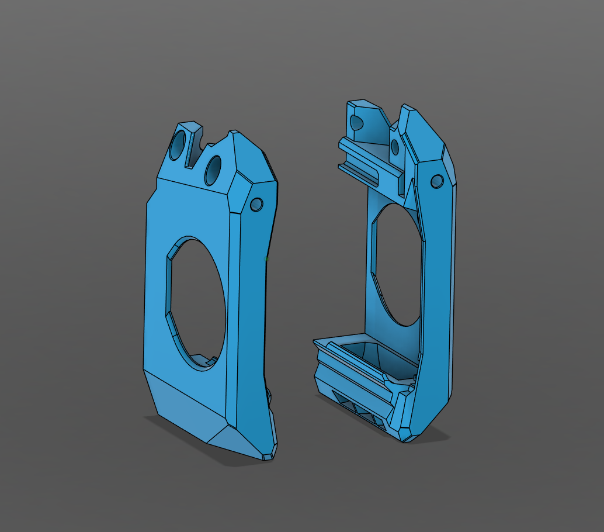
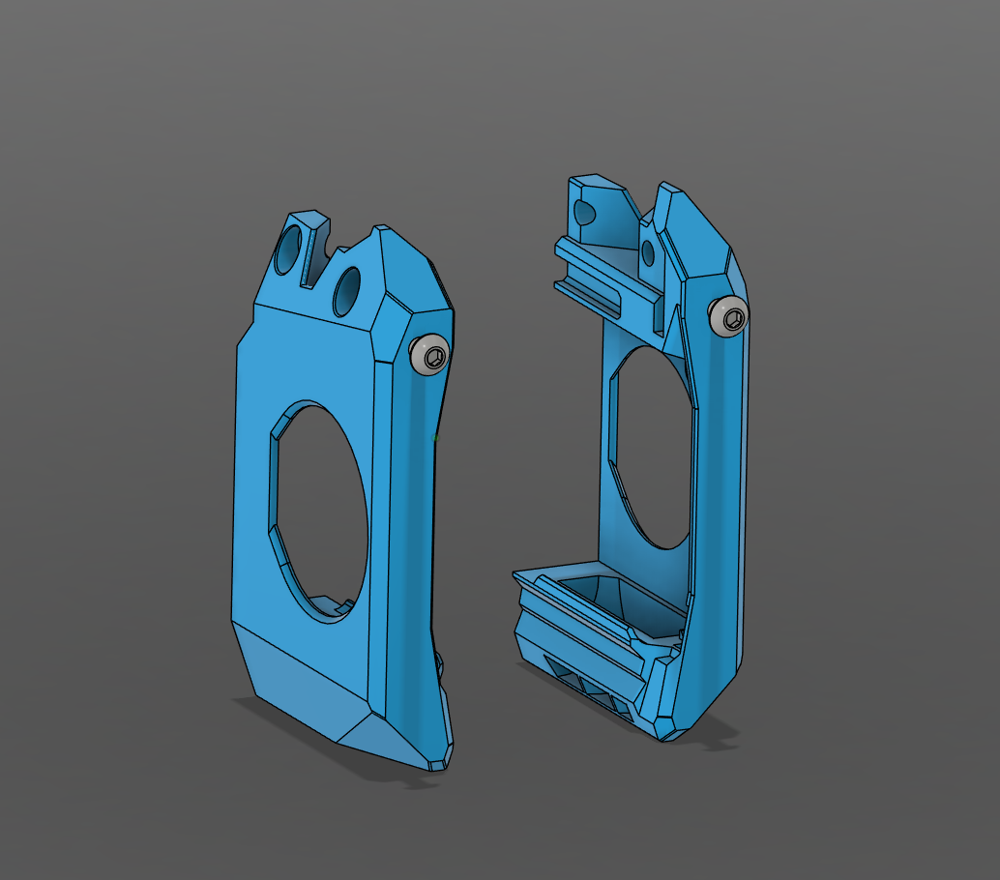
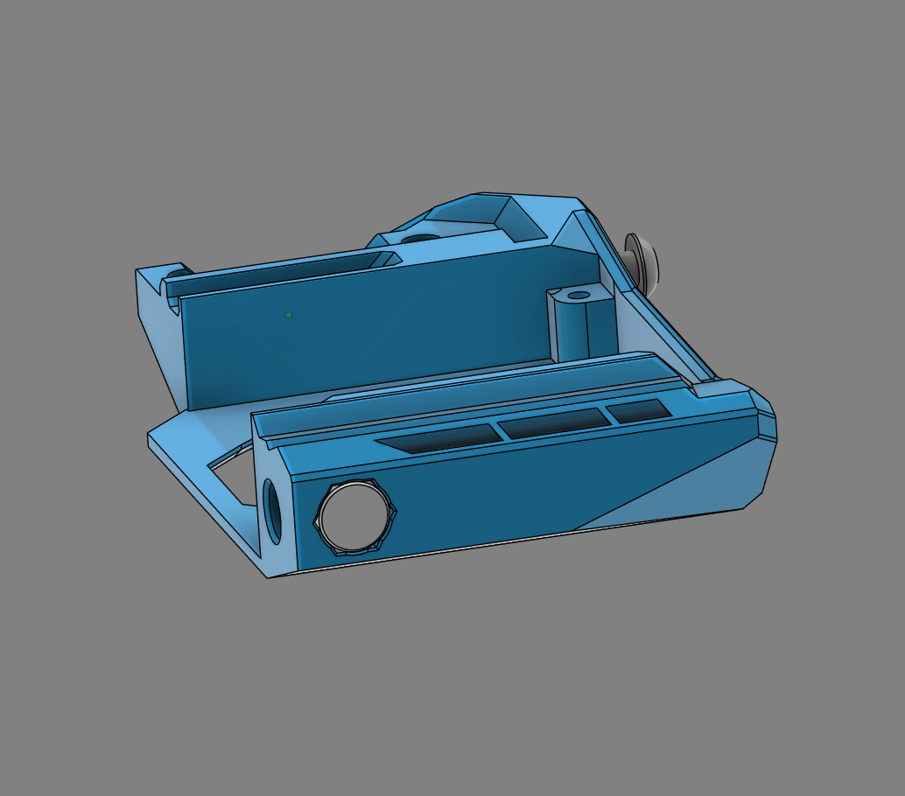

# Anthead

SF version only.

## Printing

- Left duct
- Right duct

## BOM (Per Toolhead)

- M3x12 BHCS x2

## Instructions

The Anthead for this mod is much the same as the Anthead for a typical StealthChanger. The only difference being modified ducts.

### Step 1

Replace the stock Fan Ducts with the version supplied in this repository.

### Step 2

Install an M3x12 BHCS screw to each of the Fan Ducts. Screw them in until the screw head is ~3mm away from the front of the duct. These will need to be tuned later.

### Step 3

Install a 6x3mm magnet in the bottom of either the left or right side of the duct. These magnets should be held in place with glue and are only required for the side of the printer the tool will rest in.

NOTE: The magnet needs to attract to the top magnet in the dock's blocker. Make sure it is orientated correctly. 

